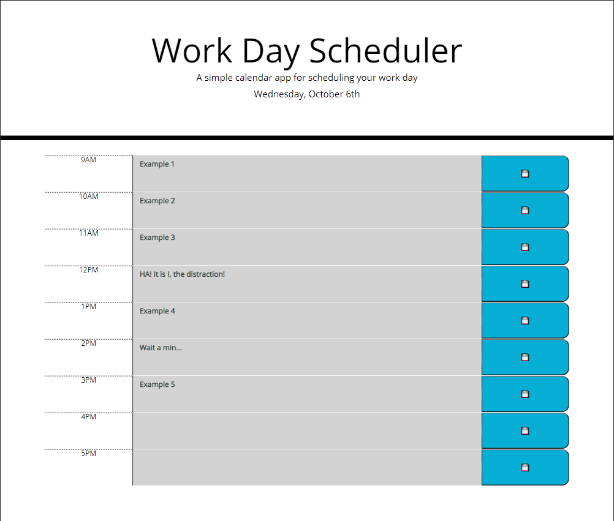

# work_day_scheduler

Importing the necessary resources in order to make a work scheduler function properly.

# pseudo code

* Create a calender that enables a user to save text data in hour intervals
* The calender is to display the CURRENT day's date at the top of the page
* The user is to be presented with time blocks/slots for each WORK HOUR interval ("Average" 9 to 5)
* Each time block/slot is to be color coordinated according to past/present/future
* User will be allowed to enter text data into a block/slot that will be saved in local data
* Each time block/slot will be situated with a save button that will responsible for actually storing the entered data into local storage
* The data must persist through page reload

# screenshot

# link

https://riveranelson99.github.io/work_day_scheduler/

## Contributing
Pull requests are welcome. For major changes, please open an issue first to discuss what you would like to change.

Please make sure to update tests as appropriate.